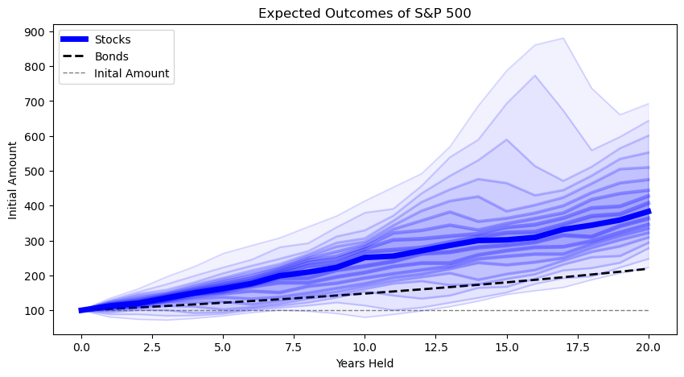
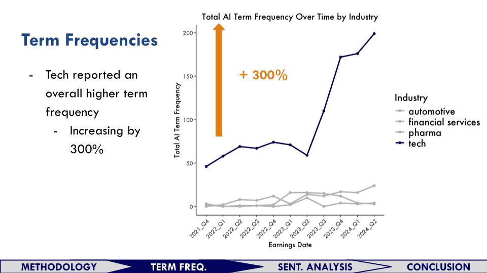
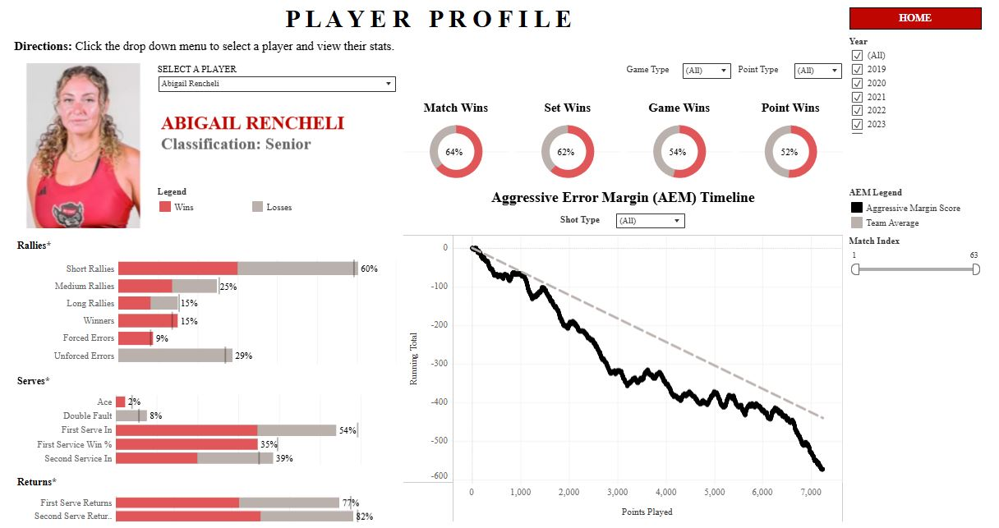

# Aspiring Data Scientist
Skilled at optimizing business processes, crafting dashboards, and improving financial decisions.

**Technical Skills:** Python, SQL, Power BI, Tableau, and R   
**Certifications:** PCEP Entry-Level Python, AWS Cloud Practitioner  

__________________________________________________________________________

## Contact Me  
**Phone Number:** 919-302-8823  
**Email:** augustm8@gmail.com  
**Linkedin:** ([/august-majtenyi](https://www.linkedin.com/in/august-majtenyi/))  
**Portfolio Website** ([visit](https://augustmajtenyi.github.io/)): showcasing design projects

__________________________________________________________________________

## Education  
M.S., Data Analytics | Institute for Advanced Analytics (_May 2025_)  
B.S., Industrial Design | Ohio State University (_May 2021_)  

__________________________________________________________________________

## Practicum  
**Team Lead** (_August 2024 - Current_)  
Academic Programs International   
- Developed a **Python** custom auotomation library with PuLP to optimize housing arrangements   
- Tuned an XGBoost **machine learning** model with cross-validation  
- Validated the model with MAPE and target shuffling
- Utilized **Shapley values** to interpret the impact of variables  
<!-- • Developing our custom automation into a fully functioning library with complete documentation  -->
<!-- • Web-scraping competitor market data for company directors to evaluate yearly session price changes  -->

__________________________________________________________________________

## Work Experience
**Junior Business Analyst** (_August 2023 - May 2024_)  
Kioti Tractors  

- Crafted **Power BI** dashboards that saved 100+ hours of efficiency yearly and pioneered daily monitoring  
- Aggregated data via **SQL** for monthly market share reports
- Built **ETL** pipelines across 6 departments
<!--  • Pioneered daily sales monitoring for company executives to make decisions on quarterly sales programs  -->

**Research Associate** (_July 2022 - July 2023_)  
PAST Foundation  
- Collected data from 700+ students to validate a STEM Identity instrument with IRB approval
- Analyzed paired **t-tests** with Bonferroni adjustment in **R**  
<!-- to identify significant trends in STEM Identity -->  
<!-- • Taught JavaScript, Game Design, and Virtual Reality 3D modeling to youth ages 10 – 18-->

__________________________________________________________________________

## Projects

**Simulating Investment Strategies** (for [_early investers_](https://augustmajtenyi.github.io/LifecycleInvesting.html) and [_retirees_](https://docs.google.com/presentation/d/1-zWkbZO2mmfR0C3_16uwTn6SoKVOny2OcJu-i-yGLlY/edit?usp=sharing))
<kbd>
  
</kbd>  
Used 40+ years of stock data to simulate high-risk investing with LEAPS (12% annualized ROI) as well as low-risk investing with yearly withdrawals (beating the 4% rule). In both cases, I argue for explicit buy/sell planning and consistent market exposure.  

**NLP Analysis with Unstructured Earnings Calls** ([_slide deck_](https://docs.google.com/presentation/d/1CUsx_gHMNNeO195B45ehTEtIM6fHCL4NptkPNdBgieM/edit?usp=sharing))
<kbd>
  
</kbd>  
NLP with web-scraped, unstructured earnings calls across 4 industries. Includes TF-IDF clustering as well as analyzing AI frequency and sentiment with the Vader package.

**NCSU Women's Tennis Dashboard** ([_full dashboard_](https://public.tableau.com/app/profile/august.majtenyi/viz/Blue17NCSUTennisDashboard/NCStatePlayerProfiles))
<kbd>
  
</kbd>  
In collaboration with NCSU coach David Secker, I processed 6 years of tennis stats and visualized 20 requested player metrics. The full dashboard contains 5 pages of different analysis for the indivudal players, leaderboard stats, and WTA points between colleges.

**Analyzing Census Data** ([_repository_](https://github.com/AugustMajtenyi/FoodAccessExploration))  
<a href="Pictures/Phoenix Population Lacking Health Insurance.png" target="_blank">
  <kbd>
    
  </kbd>
</a>  
<small>(_click image for a closer look_)</small>  
Analyzing public data from the USDA and CDC to identify food deserts. Census-tract data from 2010 and 2015 were visualized with GeoPandas and Matplotlib. This project includes an EBM model that predicts populations having low food access, also clustering analysis within high-need cities.

