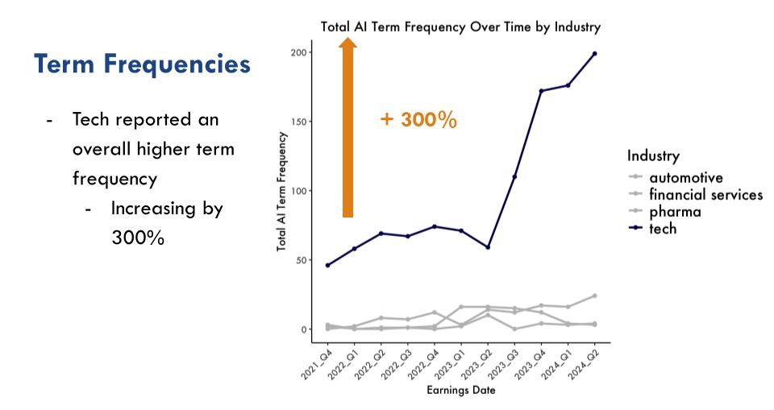

# Aspiring Data Scientist
Skilled at optimizing business processes, crafting dashboards, and improving financial decisions.

**Technical Skills:** Python, Tableau, SQL and R   
**Certifications:** PCEP Entry-Level Python, AWS Cloud Practitioner  
**Portfolio Website** ([link](https://augustmajtenyi.github.io/)): Static website from scratch to host design projects

## Contact Me  
**Phone Number:** 919-302-8823  
**Email:** augustm8@gmail.com  
**Linkedin:** [https://www.linkedin.com/in/august-majtenyi/](https://www.linkedin.com/in/august-majtenyi/)  

## Education  
M.S., Analytics | Institute for Advanced Analytics (_May 2025_)  
B.S., Design | Ohio State University (_May 2021_)

## Practicum  
**Team Lead**  
Academic Programs International (API)   
(_August 2024 - Current_)  
- Developing a Python custom auotomation library with PuLP to optimize housing arrangements   
- Tuning an XGBoost machine learning model with cross-validation  
- Validating the model with MAPE and target shuffling
- Utilizing Shapley values to interpret the impact of variables  
<!-- • Developing our custom automation into a fully functioning library with complete documentation  -->
<!-- • Web-scraping competitor market data for company directors to evaluate yearly session price changes  -->

## Work Experience
**Junior Business Analyst**           
Kioti Tractors  
(_August 2023 - May 2024_)  
• Crafted Power BI dashboards that saved 100+ hours of efficiency yearly and pioneered daily monitoring  
• Aggregated data via SQL for monthly market share reports  
• Built ETL pipelines across 6 departments
<!--  • Pioneered daily sales monitoring for company executives to make decisions on quarterly sales programs  -->

**Research Associate**
PAST Foundation  
(_July 2022 - July 2023_)  
• Collected data from 700+ students to validate a STEM Identity instrument  
• Analyzed paired t-tests with Bonferroni adjustment in R  
<!-- to identify significant trends in STEM Identity -->  
<!-- • Taught JavaScript, Game Design, and Virtual Reality 3D modeling to youth ages 10 – 18-->

## Projects
### AI analysis with Unstructured Earnings Calls

NLP with web-scraped, unstructured earnings calls across 4 industries. TF-IDF clustering and analyzing AI frequency and sentiment with the Vader package.

[Earnings Calls NLP](https://docs.google.com/presentation/d/1CUsx_gHMNNeO195B45ehTEtIM6fHCL4NptkPNdBgieM/edit?usp=sharing)
_Slide Deck_

### NCSU Women's Tennis Dashboard
[Dashboard](https://public.tableau.com/app/profile/august.majtenyi/viz/Blue17NCSUTennisDashboard/NCStatePlayerProfiles)

Culminated tennis stats over 6 years to visualize 18 requested player metrics

